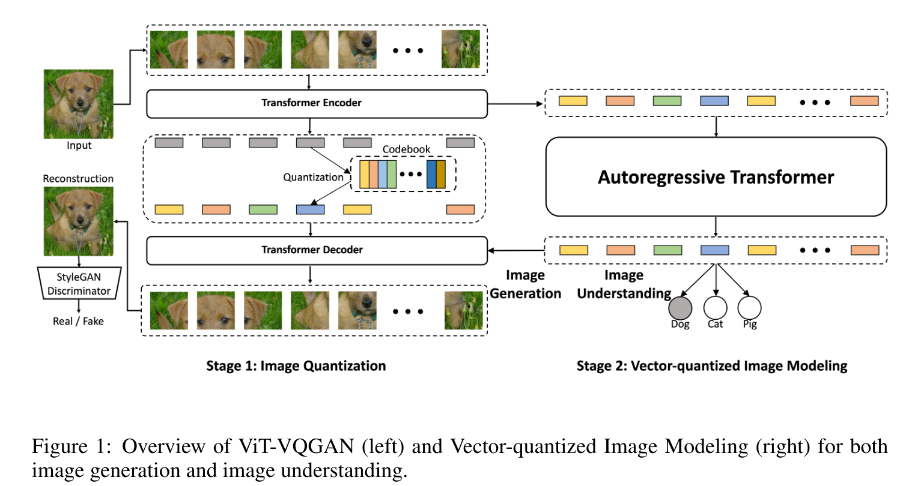

# Vector-quantized Image Modeling with Improved VQGAN
> Anonymous, under double-blind review

## Summary

The paper introduces ViT-VQGAN, improvements on VQGAN to improve the efficiency
and reconstruction quality of the quantizer. They find substantially improved
performance on image generation and unsupervised representation learning.

## Key Points

- Image modelling directly in the pixel space can be computationally
  infeasible. A common approach is to first encode the image into some smaller,
  more information rich space.

- In vector-quantized image modelling, this smaller space is a discrete space
  consisting of ids addressing some learned codebook. Another model can then
  model the density over this latent space.

- This paper states that a better quantizer may improve stage 2 generation and
  understanding. In particular, a more efficient quantizer means faster stage
  2 training (in the case that augmentation and then quantization is applied
  "on the fly"). Better reconstructions means that there is reduced information
  loss, that can be critical for trickier understanding tasks.

- The image is mapped into $8 \times 8$ image patches (when working at $256
  \times 256$ resolution, followed by some transformer blocks. This turns the
  image into a $32 \times 32 = 1024$ token sequence.

- A vanilla VQ-VAE usually suffers from poor codebook utilisation ("dead"
  codewords). They propose two methods to improve this:
    - Factorized codes, project to some smaller embedding space for codebook
      lookup, then project back to a higher dimensionality.
    - Apply $\ell_2$ norm on encoded latent variables and codebook variables.
      This maps all latent variables onto a "sphere". This means that the
      $\ell_2$ norm between latent variables and their corresponding codeword
      evolves into the cosine similarity between these variables.

- They use a combination of loss functions to train the quantizer end-to-end on
  image data. These terms are weighted, shown in section 3.3 of the paper. The
  terms are:
    - VQ Loss: standard VQ codebook loss
    - Adversarial loss: StyleGAN discriminator loss.
    - Perceptual loss: based on VGG network perceptual loss.
    - Logit-laplace: from DALLE VAE loss function. Their decoder produces six
      feature maps representing the statistics of a "logit-Laplace"
      distribution. Details are in appendix A.3 of the DALLE paper. But in
      essence it replaces the $\ell_1$ and $\ell_2$ reconstruction terms, as
      they are defined over all real numbers and so can place some likelihood
      outside the valid range of pixel values.
    - L2 loss: standard L2 norm reconstruction term.

> For the unsupervised learning experiments, they remove the perceptual loss
> term as VGG is trained with a supervised classification objective which "might"
> leak some information.

- Using a trained ViT-VQGAN, the discrete ids are flattened in a raster-scan
  order. A decoder-only transformer models the autoregressive relationship over
  these discrete variables.

> Another interesting point is that all samples are done autoregressively but
with no temperature reduction.

- They also perform experiments into classification using the learned
  representations. Similar to image GPT, they find that the best results do not
  always come from averaging over the final block output. Results for linear
  probe accuracy are shown in Appendix A, figure 3.

## Notes
- A batch size of 256 over 128 accelerators. Wow..

- The openreview version I used refers to dVAE without citation.. I truly
  wonder who the "anonymous" authors are :)

- The logit-laplace distributions finally answers a long question about why
  some models output 6 feature maps.

- The biggest contributions in my opinion are to the codebook utilisation. Some
  of the ideas can be applied to basically any method that uses a VQ codebook.

- A recent question is whether the power of ViT comes from the transformers or
  from the patching process itself. I would be curious to see the same results
  but with patching + CNN encoder.
