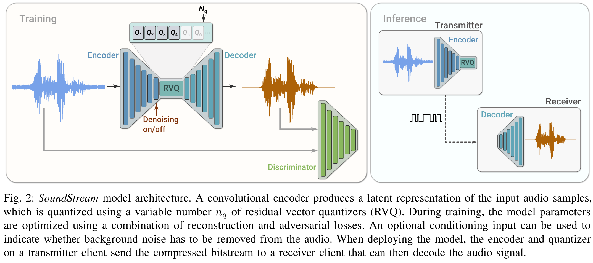

# SoundStream: An End-to-End Neural Audio Codec
> Neil Zeghidour, Alejandro Luebs, Ahmed Omran, Jan Skoglund, Marco Tagliasacchi

## Summary
The paper introduces a neural audio codec that supports a variable bitrate via
a residual vector quantizer bottleneck. It also supports denoising and
enhancement with no additional latency via a conditioning signal. It can output
existing audio codecs even when operating at a lower bit rate.

## Key Points

- The model consists of a convolutional encoder, a residual vector quantizer
  and a convolutional decoder. It is trained to minimize a mix of
  reconstruction and adversarial losses.

- The residual VQ replaces each embedding with a sum of vectors from a set of
  finite codebooks, arranged in a cascading structure where each subsequent
  codebook "refines" the embedding further and further. Algorithm 1 in the
  paper quite succinctly describes this process.

- To permit a variable bit rate at inference, we train with a variable number
  of codebooks. If we have $N_q$ codebooks, we sample $n_q \sim
  \mathcal{U}(N_q)$ and only use the first $n_q$ codebooks. This allows the
  decoder to train on outputs from a variable number of codebooks.

- Changing $n_q$ does not change size of embeddings, so the architecture does
  not need to change at different bit rates. Each codebook merely refines the
  signal.

- They use two different discriminators. One is wave based (operating at
  multiple resolutions, producing logits for all) and the other is computed
  from STFT features on the original scale.

- The loss also takes into account the difference in the internal layers of the
  discriminators between the original and reconstruction, and the
  reconstruction error between the spectral features.

- By injecting a conditioning signal into the residual VQ, we can can turn
  denoising on and off. This allows us to include enhancement in the model with
  no additional latency.

- SoundStream beats Opus and EVS at the lowest bit rates, despite using half
  their operating bitrates. In general, it operates very well on a diverse set of 
  content types and noise types. It can also run in real-time on a single phone CPU.

- Interestingly, by varying the number of codebooks $N_q$ and the size of the
  codebook $N$,  we can achieve the same bitrate with different configurations.
  They tried 80, 1-bit codebooks, resulting in only a moderate level of model
  degradation.

## Notes

- The biggest contribution in my opinion is the residual vector quantizer. The
  gradual refining of the signals seems like a really nice process, which
  supports a variable bit rate when compressing.

- I wonder if a similar idea could be applied to image compression. Actually,
  it most definitely could be, but I don't know if it would be any better than
  traditional methods of compression.

- I can't find any public implementations of this, could be fun to implement.
  Found one for the residual quantizer, but not anything for the rest.
