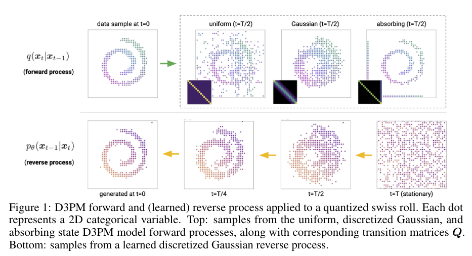

# Structured Denoising Diffusion Models in Discrete State-Spaces
> Jacob Austin, Daniel D. Johnson, Jonathan Ho, Daniel Tarlow, Rianne van den Berg

## Summary
The paper introduces a novel, general framework for forward corruption processes
on discrete data. The flexibility of the framework allows for design decisions
in how the forward diffusion process is implemented, depending on the data
domain (they experiment with four different ones). By doing so, their (D3PM)
exceeds the log-likelihood of the original DDPM (continuous) space model on
image datasets and beats other discrete DDPMs that work by simply relaxing the discrete data into continuous spaces.

## Key Points
- Background on diffusion models in general: a diffusion model is a Markov chain trained to reverse some (predefined) forward process. The aim of the forward process is to gradually corrupt the data into some pure noise, ideally noise from a static distribution. Most prior work has only successfully applied them to continuous data.

> Note the similarity here between this and score-based models, which also have some corrupting forward process.

- The choice of forward process should permit efficient sampling at an arbitrary time-step in the Markov process. Additionally, $q(x_{t-1} | x_t, x_0)$ should be tractable. Both allow for efficient training.

- For scalar discrete random variables, the forward process can be represented by transition probability matrices $Q_t$. The expression $x_{t-1}Q_t$ parameterises a categorical distribution for the next discrete value $x_t$ in the process, assuming $x_{t-1}$ is a one-hot row vector. This satisfies the requirements in the previous point (see Eq.3)

- The big advantage of this framework is that the data corruption is entirely controlled by choosing $Q_t$ which is much simpler than continuous corruption. There are two constraints on $Q_t$, one that it must be a stochastic matrix (rows sum to one) and that it must converge to a known stationary distribution (be it a static or some learned prior) for large $t$.

- These are the transition matrices they tried:
    - **Uniform**: Specifically, $Q_t = (1 - \beta_t)I + \beta_t / K \mathbf{1} \mathbf{1}^T$. i.e. at low noise ($\beta_t$), this corresponds to the identity matrix ($p=1$ for transitioning to itself) and at high noise it corresponds to the uniform distribution. This is doubly stochastic.
    - **Absorbing**: The transition matrix where each token either stays the same, or transitions to a [MASK] state with probability $\beta_t$. This does not define relationships between discrete categories, but still allows the corruption of entries. This is somewhat akin to masking in MLM. 
    - **Discretized Gaussian**: Using a discretized Gaussian distribution, normalized to be doubly stochastic. As it is Gaussian, it will transition more frequently between similar states. This makes it suited for ordinal data (such as discrete pixel values)
    - **Token embedding distance**: if embeddings are available, we can define a transition matrix that transitions more frequently between tokens with similar embeddings whilst still ultimately converging to a uniform stationary distribution. 

- They also explore many options for the noise schedule ($\beta_0, \dots, \beta_T$). For Gaussian diffusion, the variance is linearly increased. For uniform, cosine scheduling. For others, they take the literal approach and literally linearly interpolate the mutual information between the data $x_0$ and the corrupted sample $x_t$ to zero.

- The neural network does not directly predict the logits $p_\theta (x_{t-1} | x_t)$ but instead predicts $p_\theta (x_0 | x_t)$ which is reparameterised as in Eq(4). They say the reparamterization has two advantages. One that it automatically ensures the learn reverse distribution follows the same sparsity pattern as the chosen $Q_t$. Secondly, it allows for inference multiple steps in the future. It is also possible to not directly predict logits and instead model the discretized logistic distribution.

> I think the "truncated discretized logistic distribution" refers to a similar approach to the output of PixelCNN++. Not sure though..

- The loss function uses an alternative loss function: the combination of the negative variational lower bound and a reconstruction term. The reconstruction term encourages "good" reconstructions regardless of the timestep. It seems to be discounted rather heavily though (as it would be hard to reconstruct from heavily corrupted). For image generation they chose $\lambda = 0.001$

- They make some interesting connections between D3PM and existing models. For example, BERT is a one-step diffusion model with $Q_t$ being the combination of a uniform (for random token replacement) and absorbing (for masking). Autoregressive models are the diffusion process where $Q_t$ replaces one token each step. Generative MLM (such as "BERT has a mouth") are also clearly diffusion models (though in that paper, they formulate it as an EBM).

- For images, they say their architecture is based on the backbone for PixelCNN++. i.e: a U-Net with "Wide ResNet" and some attention mechanism at the $16 \times 16$ resolution level. They include information about $t$ in the model using sinusoidal embeddings (like in vanilla Transformers) injected into each block. For text, they used a standard transformer encoder (following the T5 model architecture).

## Notes
- Idea of training an end-to-end D3PM with a VQ-VAE, to support samples at a
  higher resolution (VQ-DDPM?). Somewhat akin to [LSGM](notes/score-based-in-latent-space.md)
- I am wondering if it is possible to parameterize the forward process as a continuous time problem. Maybe they did this somewhere in the paper and I missed it, but it seems odd with all the success SGMs with SDEs have had to not explore this.
- They say higher values of $\lambda$ led to a rapid increase in performance early in training, but ultimately did not perform as well. I wonder if this parameter is worth annealing to get the best of both worlds? 
- I really think the flexibility of the framework is really neat :)
