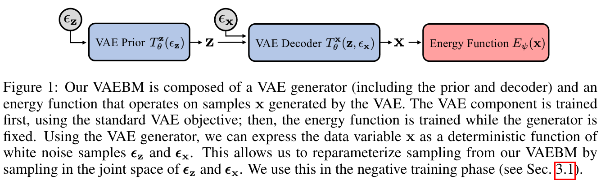

# VAEBM: A Symbiosis between Variational Autoencoders and Energy-based Models
> Zhisheng Xiao, Karsten Kreis, Jan Kautz, Arash Vahdat

## Summary
This paper proposes the combination of a VAE model with an EBM corrector. This
intends to address the weaknesses of both models by forming a "symbiotic"
relationship. By doing so, they outperform the SOTA in both VAEs and EBMs (at
the time) by a large margin with improved sampling speeds over EBMs.

## Key Points

- VAEs often assign high probability to regions in the data space that are
  actually outside the data distribution. EBMs explicitly penalise this during
  training.

- VAEs are quick to sample from and quick to traverse the latent space. EBMs are
  slow, and often require expensive MCMC steps.

- The combination of the two therefore permits faster sampling (by pushing MCMC
  updates) into the latent space and reduces the likelihood of non-data-like
  regions of data space using the EBM -- akin to a final refining of the samples
  from the VAE.

- In the first stage of training, the VAE (in their work: NVAE) model is trained
  like normal. In the second stage, they freeze the VAE model and only train the
  EBM component. There is an extension that allows for a training objective that
  also trains the VAE.

- During EBM training, there is a positive and negative phase. The positive
  samples data point from the dataset. The negative samples data from the VAE
  generator. The likelihood of these generated samples (as predicted by the EBM)
  can be reduced explicitly. This has some similarity with a GAN discriminator.

- Rather than sampling pixels directly in the negative phase, VAEBM
  reparametrizes on the joint space of $z$ and $x$. Rather than sampling $z \sim
  p(z)$ and then $x \sim p_\theta(x \vert z)$, they instead sample $(\epsilon_z,
  \epsilon_x) = p_\epsilon = \mathcal{N}(0, I)$ and uses a deterministic
  transformation to map the noise to their respective variables.

> These deterministic transformations are known as $T^z_\theta(\epsilon_z)$ and
> $T^x_\theta(z, \epsilon_x)$. I think these correspond to the prior and decoder
> of the VAE respectively, but I am not totally sure.

- Sampling from $p_\epsilon$ has the added advantage of $\epsilon_x$ and
  $\epsilon_z$ being of the same scale, meaning we do not need to tune the
  sampling step sizes. They can simply be constant. This is particularly helpful
  for hierarchical $z$ such as in NVAE or VD-VAE.

- I think the sampling process is done by sampling some $\epsilon$ noise,
  decoding it with the VAE, then evaluating it with an EBM in pixel space, in
  order to guide the Langevin dynamic in the latent space. 

## Notes

- I am not entirely sure I fully understand how sampling is done. Not too
  familiar with EBMs yet, though it feels similar to diffusion models. The
  concept of refining a VAE output using some other model is neat though ~

- Along that vein, perhaps it is possible to replace the EBM component with
  something like an DDPM or NCSN? Or even use a discrete VAE and have a D3PM
  component?

- I wonder if a longer chain could improve performance. The author's replies to
  reviewers with the same question seems to suggest no.

- Where is the code for this? I can only find one with 2 stars :(
